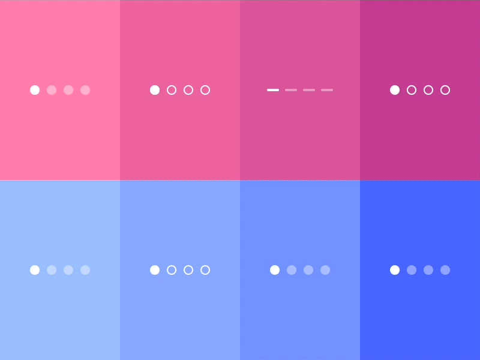
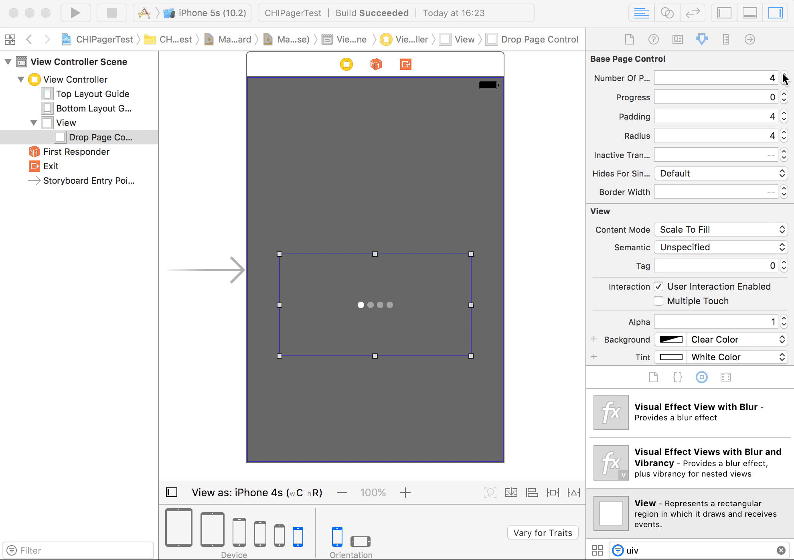
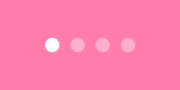

# CHIPageControl

CHIPageControl is a set of cool animated page controls to replace boring UIPageControl.
We were inspired by [Jardson Almeida dribbble shot](https://dribbble.com/shots/2578447-Page-Control-Indicator-Transitions-Collection) and implemented a few more page controls.

Made with ❤️ by [Chili](http://chi.lv).

## Overview



## Requirements

* iOS 8.0+
* Xcode 8+
* Swift 3

## Installation

### Manually

Just add the `CHIPageControl` folder to your project.

### CocoaPods

use [CocoaPods](https://cocoapods.org) with Podfile:
``` ruby
pod 'CHIPageControl', '~> 0.1.3'

# individual page control
pod 'CHIPageControl/Aji'
pod 'CHIPageControl/Aleppo'
pod 'CHIPageControl/Chimayo'
pod 'CHIPageControl/Fresno'
pod 'CHIPageControl/Jalapeno'
pod 'CHIPageControl/Jaloro'
pod 'CHIPageControl/Paprika'
pod 'CHIPageControl/Puya'
```
### Carthage

use [Carthage](https://github.com/Carthage/Carthage) with Cartfile
```ogdl
github "ChiliLabs/CHIPageControl" ~> 0.1.3
```


## Usage
### 🎨 Storyboards
Just drop UIView and set its class to be one of CHIPageControls.

### 💻 Code
``` swift
let pageControl = CHIPageControlAji(frame: CGRect(x: 0, y:0, width: 100, height: 20))
pageControl.numberOfPages = 4
pageControl.radius = 4
pageControl.tintColor = .red
pageControl.currentPageTintColor = .green
pageControl.padding = 6
```

### Adding multiple tintColors
``` swift
// The size of the array needs to match the numberOfPages or it will throw an fatal error
pageControl.tintColors = [UIColor.black, UIColor.yellow, UIColor.black, UIColor.black]

// or

// If it is the first one, it will fill all colors with the selected tintColor and then replace the colors with the desired one
pageControl.insertTintColor(UIColor.yellow, position: 1)
```

### Updating progress
``` swift
//update dynamically
pageControl.progress = 0.5

//set progress with animation
pageControl.set(progress: 2, animated: true)
```
### Page Controls 🌶️🌶️🌶️

 CHIPageControlAji

 CHIPageControlAleppo

 CHIPageControlChimayo

 CHIPageControlFresno

 CHIPageControlJalapeno

 CHIPageControlJaloro

 CHIPageControlPaprika

 CHIPageControlPuya

## License
CHIPageControl is released under the MIT license. See [LICENSE](./LICENSE) for details.
