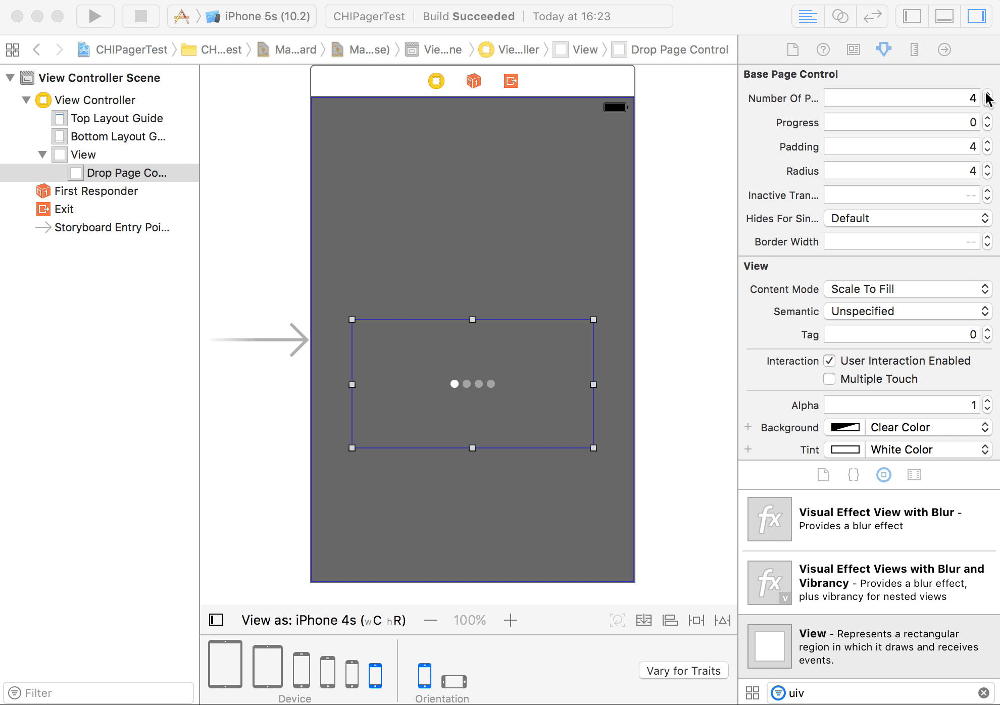

# CHIPageControl

CHIPageControl is a set of cool animated page controls to replace boring UIPageControl.
We were inspired by [Jardson Almeida dribbble shot](https://dribbble.com/shots/2578447-Page-Control-Indicator-Transitions-Collection) and implemented a few more page controls.

Made with ❤️ by [Chili](http://chi.lv).

## Overview


## Requirements

* iOS 9.0+
* Xcode 8+
* Swift 3

## Installation

Just add the `CHIPageControl` folder to your project.

or use [CocoaPods](https://cocoapods.org) with Podfile:
``` ruby
pod 'CHIPageControl', '~> 0.0.1'
```

## Usage
### 🎨 Storyboards
Just drop UIView and set its class to be one of CHIPageControls.

### 💻 Code
``` swift
let pageControl = CHIPageControlAji(frame: CGRect(x: 0, y:0, with: 100, height: 20))
pageControl.numberOfPages = 4
pageControl.radius = 4
pageControl.tintColor = .red
pageControl.padding = 6
```
### Updating progress
``` swift
//update dinamically
pageControl.progress = 0.5

//set progress with animation
pageControl.set(progress: 2, animated: true)
```
### Page Controls 🌶️🌶️🌶️
- CHIPageControlAji
- CHIPageControlAleppo
- CHIPageControlChimayo
- CHIPageControlFresno
- CHIPageControlJalapeno
- CHIPageControlJaloro
- CHIPageControlPaprika
- CHIPageControlPuya

## License
Airstream is released under the MIT license. See [LICENSE](./LICENSE) for details.
